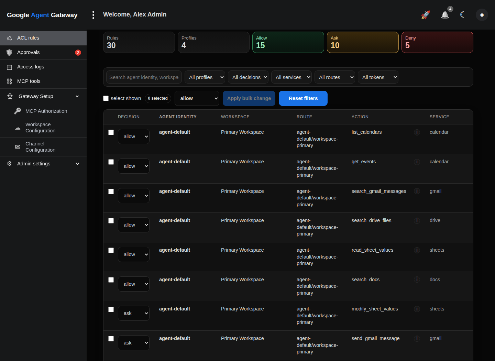
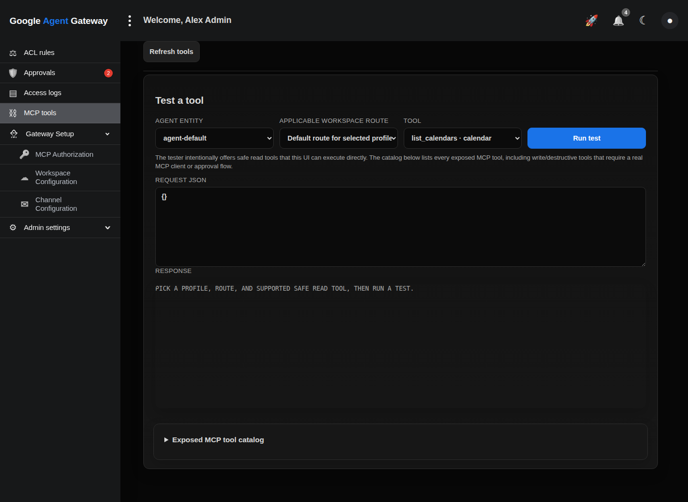
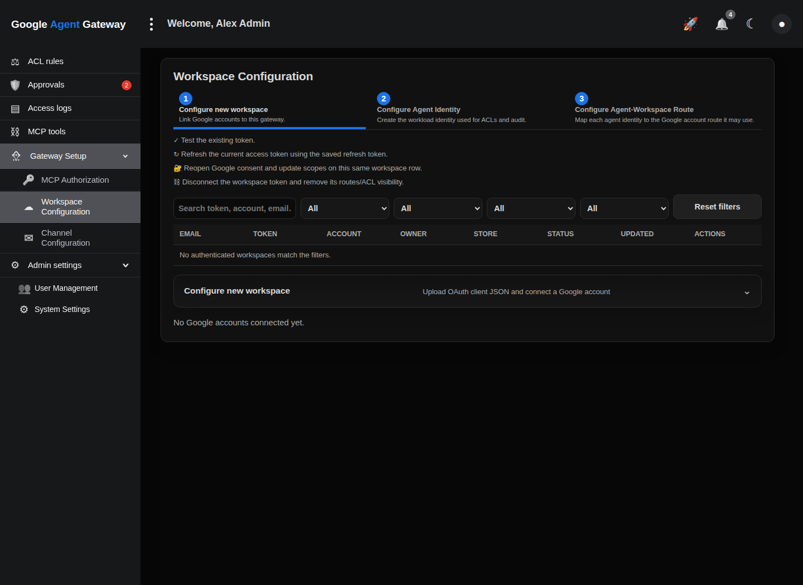
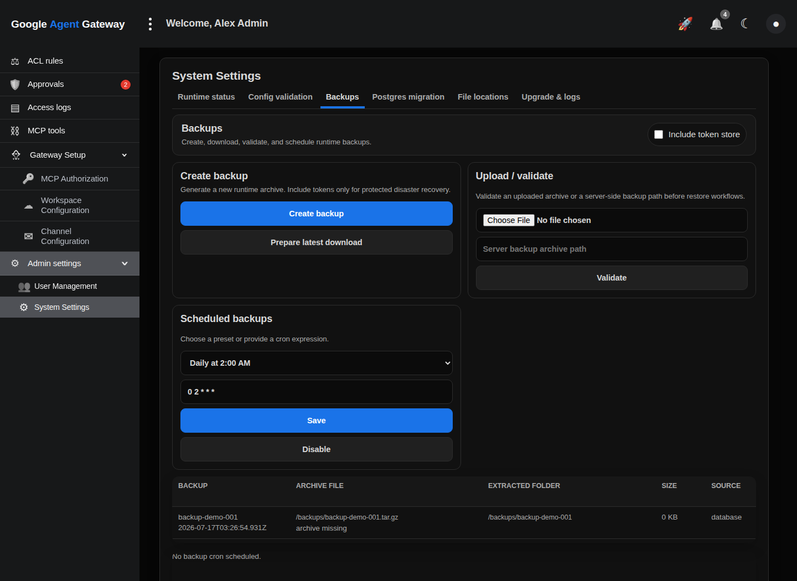

# Google Workspace Governance Gateway Demo

Static Cloudflare Pages demo of the Google Workspace Governance Control UI.

Important: this demo copies the production Control UI HTML/CSS/JavaScript from `google_governance_control_plane.py`; only the API responses are mocked in-browser. The layout, navigation, tabs, settings rail, tables, modals, and responsive behavior should match the real control plane.

## Cloudflare Pages

- Framework preset: `None` / static HTML
- Build command: leave blank
- Build output directory: `/`

## Local preview

```bash
python3 -m http.server 8787
```

Then open `http://127.0.0.1:8787/`.

## Screenshots

These screenshots are generated from the same static demo page. They are not separate mockups.

| View | Screenshot |
| --- | --- |
| Login |  |
| ACL rules |  |
| Approvals |  |
| Access logs |  |
| MCP tools |  |
| Gateway Setup — MCP Authorization |  |
| Gateway Setup — Workspace Configuration |  |
| Gateway Setup — Channel Configuration |  |
| Admin Settings — Runtime Status |  |
| Admin Settings — Runtime Backups |  |

## Regenerating screenshots

```bash
python3 scripts/capture_screenshots.py
```
